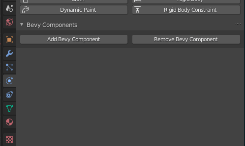

# About

[Bevy](https://bevyengine.org/) is a game engine written in the Rust 
programming language. It's currently rather early stages and doesn't 
have any sort of editor. So until it does, the only way to assign 
custom components to objects is through code. That's where 
`blender_bevy_toolkit` comes in. It provides a UI for adding components 
to objects in [blender](https://www.blender.org/) and exports
the blender scene to bevy's scn format.

*Note:* I am developing this for my specific game and use case, so the 
exporter may not include all the features your game requires. PR's 
welcome!


# Instructions
1. Copy or symlink the `blender_bevy_toolkit` subfolder (the one with all 
the python) into your blenders addons folder. On linux this is 
`.config/blender/2.92/scripts/addons`. 

2. Create a scene in blender

3. Add blender_bevy_toolkit to your Cargo.toml
```toml
[dependencies]
blender_bevy_toolkit = {path="../blender_bevy_toolkit"}
```

4. Add the `BlendLoadPlugin` 
```rust
use blender_bevy_toolkit::BlendLoadPlugin;
let mut builder = App::build();
builder = builder.add_plugin(BlendLoadPlugin::default());
```

4. You can now load scenes the normal way:
```rust
let scene_handle: Handle<DynamicScene> =
    asset_server.load("models/Collections/PhysicsTest.scn");
scene_spawner.spawn_dynamic(scene_handle);
```


# Supported Features:

## A UI!
The whole point of this integration is to allow use of a user interface 
for creating scenes and adding components! So here's what using it 
looks like:




## Collection Export
The exporter exports all the collections in the blend file, including
mesh data and hierarchy.

*Note*: This will likely change in the near future to exporting the 
current blender scene. 

## Physics Export
Physics objects are exported with an integration with 
[bevy_rapier](https://github.com/dimforge/bevy_rapier)


## Custom Components
Custom components allow your game-specific logic to be added through
the same blender interface. Most custom components can be defined 
through simple JSON files, and those that require more complex 
behaviour can be implemented as python files. Custom components are 
stored externally to the addon (the addon looks for the folder 
`component_definitions` in the directory of the blend file), so you can 
work on multiple games without conflicts.


# Version Information:

Rust:

* bevy 0.6.0
* bevy_rapier 0.12.0

Blender:

* blender 3.x (may work on others)


# Developing

The makefile runs a script to export some blends from the `test_scenes`
folder. 

You should install:
```
pip install black

```
